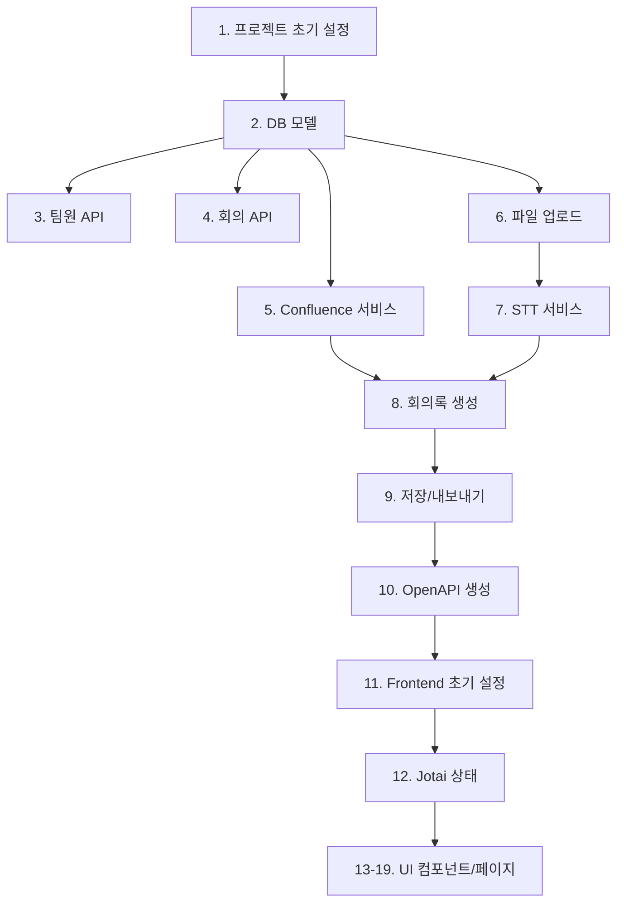

# WeeklyRun Development Tasks

> **개발 순서:** Backend → API 테스트 → OpenAPI → Frontend
> **Phase 순서:** P1-lite → P1-full → P2 (필수)

---

## P1-lite: Domain Validity Phase

### 목표
녹음 파일 업로드 → STT → 주간업무록 참조 회의록 생성 → Confluence 업로드
파이프라인 end-to-end 검증

---

### Backend Tasks

#### 1. 프로젝트 초기 설정
| Task | 병렬 | 설명 |
|------|------|------|
| 1.1 apps/api 구조 생성 | - | FastAPI 프로젝트 초기화 |
| 1.2 Docker Compose 인프라 | ✅ | PostgreSQL, Redis, MinIO |
| 1.3 Alembic 설정 | - | DB 마이그레이션 설정 |
| 1.4 환경변수 설정 | ✅ | .env 템플릿 생성 |

#### 2. DB 모델 및 마이그레이션
| Task | 병렬 | 설명 |
|------|------|------|
| 2.1 Team 모델 | - | 팀 기본 정보 |
| 2.2 TeamMember 모델 | ✅ | 팀원 정보, 순서 |
| 2.3 Meeting 모델 | ✅ | 회의 정보, 상태 |
| 2.4 Recording 모델 | ✅ | 녹음 파일 정보 |
| 2.5 Transcript 모델 | - | STT 결과 |
| 2.6 WeeklyReport 모델 | - | 주간업무록 파싱 결과 |
| 2.7 MeetingMinutes 모델 | - | 회의록 |
| 2.8 Seed 데이터 | - | 제품기술팀 + 팀원 5명 |

#### 3. 팀원 관리 API
| Task | 병렬 | 설명 |
|------|------|------|
| 3.1 GET /api/team-members | ✅ | 팀원 목록 조회 |
| 3.2 POST /api/team-members | ✅ | 팀원 추가 |
| 3.3 PUT /api/team-members/:id | ✅ | 팀원 수정 |
| 3.4 DELETE /api/team-members/:id | ✅ | 팀원 삭제 |
| 3.5 PUT /api/team-members/order | - | 순서 변경 |

#### 4. 회의 API
| Task | 병렬 | 설명 |
|------|------|------|
| 4.1 GET /api/meetings | ✅ | 회의 목록 |
| 4.2 POST /api/meetings | - | 회의 생성 (upload 모드) |
| 4.3 GET /api/meetings/:id | ✅ | 회의 상세 |
| 4.4 PUT /api/meetings/:id | ✅ | 회의 수정 |
| 4.5 DELETE /api/meetings/:id | ✅ | 회의 삭제 |

#### 5. Confluence 연동 서비스
| Task | 병렬 | 설명 |
|------|------|------|
| 5.1 Confluence API v2 클라이언트 | - | 인증, 기본 요청 |
| 5.2 POST /api/confluence/fetch | - | 주간업무록 페이지 조회 |
| 5.3 주간업무록 파싱 로직 | - | MD → 구조화 (대분류/소분류/상태) |
| 5.4 POST /api/confluence/parse | - | 파싱 API |
| 5.5 Fallback 처리 | - | 수동 입력 지원 |

#### 6. 녹음 파일 업로드 API
| Task | 병렬 | 설명 |
|------|------|------|
| 6.1 파일 스토리지 서비스 | - | 로컬/MinIO 저장 |
| 6.2 POST /api/recordings/upload | - | 파일 업로드 (100MB 제한) |
| 6.3 파일 검증 | - | 포맷, 크기 검증 |

#### 7. STT 서비스
| Task | 병렬 | 설명 |
|------|------|------|
| 7.1 ElevenLabs API 클라이언트 | - | STT 호출 |
| 7.2 Background Task 처리 | - | 비동기 STT 실행 |
| 7.3 GET /api/recordings/:id/status | - | 처리 상태 조회 (Polling) |
| 7.4 GET /api/recordings/:id/transcript | - | STT 결과 조회 |
| 7.5 오류 처리 및 재시도 | - | 실패 시 retry 로직 |

#### 8. 회의록 생성 서비스
| Task | 병렬 | 설명 |
|------|------|------|
| 8.1 GPT 클라이언트 | - | 회의록 생성 API |
| 8.2 프롬프트 설계 | - | 주간업무록 참조, 용어 교정 |
| 8.3 POST /api/meetings/:id/minutes/generate | - | 회의록 생성 |
| 8.4 교정 목록 추출 | - | 단순화 버전 (위치 매핑 없음) |
| 8.5 누락 항목 감지 | - | 하이브리드 매칭 |

#### 9. 회의록 저장/내보내기 API
| Task | 병렬 | 설명 |
|------|------|------|
| 9.1 PUT /api/meetings/:id/minutes | ✅ | 회의록 저장 (draft) |
| 9.2 GET /api/meetings/:id/minutes/download | ✅ | MD 다운로드 |
| 9.3 POST /api/meetings/:id/minutes/publish | - | Confluence 업로드 |
| 9.4 업로드 재시도 로직 | - | 실패 시 로컬 저장 |

#### 10. OpenAPI 문서 생성
| Task | 병렬 | 설명 |
|------|------|------|
| 10.1 OpenAPI JSON 생성 | - | FastAPI 자동 생성 |
| 10.2 API 문서 검증 | - | Swagger UI 확인 |

---

### Frontend Tasks

> ⚠️ Backend OpenAPI 생성 완료 후 시작

#### 11. 프로젝트 초기 설정
| Task | 병렬 | 설명 |
|------|------|------|
| 11.1 apps/web 구조 생성 | - | Next.js 16 초기화 |
| 11.2 shadcn/ui 설정 | ✅ | 컴포넌트 라이브러리 |
| 11.3 TailwindCSS v4 설정 | ✅ | 스타일링 |
| 11.4 Orval 설정 | - | API 클라이언트 생성 |

#### 12. 전역 상태 설계 (Jotai)
| Task | 병렬 | 설명 |
|------|------|------|
| 12.1 atoms/team | ✅ | 팀 정보 |
| 12.2 atoms/meeting | ✅ | 회의 설정, 참석자 |
| 12.3 atoms/recording | ✅ | 파일 업로드 상태 |
| 12.4 atoms/stt | ✅ | STT 처리 상태 |
| 12.5 atoms/minutes | ✅ | 회의록 편집 상태 |
| 12.6 atoms/confluence | ✅ | Confluence 연동 |
| 12.7 atoms/ui | ✅ | 모달, 토스트, 로딩 |

#### 13. 공통 컴포넌트
| Task | 병렬 | 설명 |
|------|------|------|
| 13.1 Weeky 컴포넌트 | - | 3개 표정 (thinking/done/sorry) |
| 13.2 ProgressBar 컴포넌트 | ✅ | STT 진행률 |
| 13.3 FileUpload 컴포넌트 | ✅ | 드래그앤드롭 |
| 13.4 Toast 알림 | ✅ | 오류/성공 메시지 |

#### 14. 팀 대시보드 페이지
| Task | 병렬 | 설명 |
|------|------|------|
| 14.1 대시보드 레이아웃 | - | 헤더, 최근 회의 |
| 14.2 회의 카드 컴포넌트 | ✅ | 날짜, 상태, 키워드 |
| 14.3 새 회의 시작 버튼 | ✅ | 방식 선택으로 이동 |

#### 15. 회의 시작 방식 선택 페이지
| Task | 병렬 | 설명 |
|------|------|------|
| 15.1 방식 선택 UI | - | 실시간/업로드 카드 |
| 15.2 업로드 모드 선택 | - | P1-lite에서는 업로드만 |

#### 16. 녹음 파일 업로드 설정 페이지
| Task | 병렬 | 설명 |
|------|------|------|
| 16.1 회의 유형 선택 | ✅ | 주간업무보고 체크 |
| 16.2 Confluence 연동 UI | - | 자동 감지, URL 입력 |
| 16.3 참석자 체크 UI | ✅ | 팀원 목록 |
| 16.4 파일 업로드 UI | - | 드래그앤드롭, 100MB 제한 |
| 16.5 업로드 진행률 | - | 프로그레스바 |

#### 17. STT 처리 화면
| Task | 병렬 | 설명 |
|------|------|------|
| 17.1 3단계 진행 UI | - | Voice/Terminology/Formatting |
| 17.2 Weeky thinking 표정 | ✅ | 처리 중 상태 |
| 17.3 Polling 로직 | - | 상태 확인 |
| 17.4 완료/오류 처리 | - | done/sorry 표정 |

#### 18. 회의록 첨삭 페이지
| Task | 병렬 | 설명 |
|------|------|------|
| 18.1 TipTap 에디터 설정 | - | Markdown WYSIWYG |
| 18.2 툴바 컴포넌트 | ✅ | B/I/U/목록/Undo/Redo |
| 18.3 AI 교정 목록 패널 | - | 단순화 버전 |
| 18.4 자동 저장 (30초) | - | 드래프트 저장 |
| 18.5 Save Draft 버튼 | ✅ | user_draft 저장 |
| 18.6 Download MD 버튼 | ✅ | 마크다운 다운로드 |
| 18.7 Upload to Confluence 버튼 | - | 업로드 + 재시도 |

#### 19. 팀원 관리 페이지
| Task | 병렬 | 설명 |
|------|------|------|
| 19.1 팀원 목록 테이블 | - | 순서, 이름, 기본참석 |
| 19.2 드래그 순서 변경 | - | DnD 라이브러리 |
| 19.3 팀원 추가/수정 모달 | ✅ | 폼 UI |

---

### P1-lite Definition of Done (DoD)

- [ ] **E2E 파이프라인:** 녹음 업로드 → STT → 회의록 생성 → 저장/다운로드 동작
- [ ] **Confluence 업로드:** 회의록 Confluence 페이지로 업로드 성공
- [ ] **주간업무록 참조:** 용어 교정 반영, 누락 항목 "※ 언급되지 않음" 표시
- [ ] **AI 교정 목록:** 교정된 용어 목록 표시 (위치 매핑 없음)
- [ ] **상태 일관성:** Meeting/Recording/MeetingMinutes 상태 전이 정상
- [ ] **오류 처리:** STT/AI/Confluence 실패 시 오류 코드, 재시도 가능
- [ ] **테스트:** 커버리지 80% 이상
- [ ] **Lint/Build:** 오류 0건

---

## P1-full: Orchestration Phase

> ⚠️ P1-lite 완료 후에만 시작

### Backend Tasks

| Task | 설명 |
|------|------|
| 실시간 회의 API | 회의 시작/진행/종료 상태 관리 |
| 브라우저 녹음 저장 | MediaRecorder 녹음 파일 처리 |
| 질문 트리 생성 | 주간업무록 → 질문 구조화 |

### Frontend Tasks

| Task | 설명 |
|------|------|
| 실시간 회의 진행 UI | 2분할 레이아웃 |
| 질문 트리 컴포넌트 | 대분류/소분류 진행 |
| Weeky 12개 에셋 | 전체 표정 지원 |
| 키보드 단축키 | Space/Enter/Esc/←/→ |
| **AI 교정 완전 버전** | position 포함, 인라인 하이라이트 |
| 브라우저 녹음 | MediaRecorder + 복구 |

---

## P2: Multi-Team & Extensions

> ⚠️ P1-full 완료 후에만 시작

### Backend Tasks

| Task | 설명 |
|------|------|
| 팀 CRUD API | 멀티 팀 지원 |
| 팀 인증 API | 비밀번호 입장 |
| 단어집 API | 팀별 용어 관리 |
| 잡담 필터링 | AI 분류 + 학습 |
| 일반 회의 모드 | 자유 토론 지원 |

### Frontend Tasks

| Task | 설명 |
|------|------|
| 팀 선택 페이지 | 팀 목록, 비밀번호 입력 |
| 팀 관리 페이지 | 팀 등록/수정/Confluence 설정 |
| 휴지통 패널 | 잡담 필터링 UI |
| 설정 페이지 | 단어집, 필터링 설정 |

---

## Task Dependencies



---

## Parallel Execution Guide

### Backend 병렬 가능 그룹
```
Group A: 3.1, 3.2, 3.3, 3.4 (팀원 CRUD)
Group B: 4.1, 4.3, 4.4, 4.5 (회의 조회/수정/삭제)
Group C: 9.1, 9.2 (저장/다운로드)
```

### Frontend 병렬 가능 그룹
```
Group A: 12.1~12.7 (모든 Jotai atoms)
Group B: 13.2, 13.3, 13.4 (공통 컴포넌트)
Group C: 14.2, 14.3 (대시보드 하위)
Group D: 18.2, 18.5, 18.6 (에디터 하위)
```
